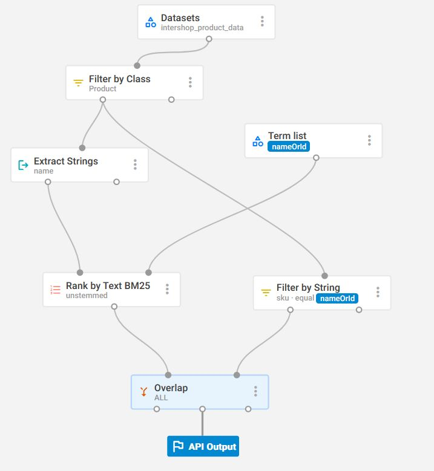

# hackathon2301-bo-search-sparque
Replace the default SQL based ICM backoffice search by ... a REST API call --- to Sparque.ai
- [hackathon2301-bo-search-sparque](#hackathon2301-bo-search-sparque)
  - [Introduction](#introduction)
  - [Install](#install)
  - [More Details](#more-details)

## Introduction

a component set icm-sparque-bo with a cartridge ac_bo_search_sparque that implements the ProductBOSearchService to replace the ICM search in the backoffice.

## Install

Prerequisite is an ICM (development) environment above 7.10.32 (used a development environment with ~7.10.40)

- checkout to icm-sparque-bo 
  ```
  git clone git@github.com:intershop/hackathon2301-bo-search-sparque.git icm-sparque-bo
  ```
- build and publish the cartridge
  ```
  gradlew publish
  ```
- include the cartridge into deployment of the assembly e.g. in inspired-b2c/build.gradle
  ```
  include('com.intershop.sparque.bo:ac_bo_search_sparque',
                            in:[development, test, production])
  ```
- add the cartridge to the list
  ```
  order = listFromAssembly('com.intershop.assembly:commerce_management_b2c') + 'ac_bo_search_sparque'
  ```
- add a configuration property to actually use it
  
  The property can be added globally or in a file for a specific context to app e.g. in `share/config/apps/intershop.B2CBackoffice` or domain scope e.g. `share/config/domains/inSPIRED-Site` 
  ```
  intershop.product.search.serviceID=sparque-bo-search
  ```

## More Details

There is not much functionality in here. Only the simple search in a basic way was working. It uses an interface that exists already for a while, it was supposed to make it possible to replace the search in the backoffice by something else. Just a Proof-of-concept that it still works somehow. 

The search service is plugged in via Guice. The [objectgraph.properties](https://github.com/intershop/hackathon2301-bo-search-sparque/blob/main/ac_bo_search_sparque/src/main/resources/resources/ac_bo_search_sparque/objectgraph/objectgraph.properties) guice [module](https://github.com/intershop/hackathon2301-bo-search-sparque/blob/main/ac_bo_search_sparque/src/main/java/com/intershop/adapter/search/bo/sparque/internal/AcBoSearchSparqueModule.java) binds the [implementation](https://github.com/intershop/hackathon2301-bo-search-sparque/blob/main/ac_bo_search_sparque/src/main/java/com/intershop/adapter/search/bo/sparque/internal/SparqueProductBOSearchService.java) to the ProductBOSearchService. 

In ICM there is provider that looks up the configuration via the property `intershop.product.search.serviceID`  in the current application context and a supported search type (SearchType.SIMPLE or SearchType.ADVANCED).

The REST call uses the com.intershop:common-webinterface (based on Jersey/JAX-RS) and Jackson is used to parse the response into some POJO Java objects. The POJO objects were simply generated out of the response json with https://www.jsonschema2pojo.org/ (Edited later to replace the localized name and shortDescription with a Map - although that is not really used)

A second rest calls determines the total items of the result - to get the  paging with the PageableIterator to work.  

The result response items are mapped back to ProductBO with the attribute sku from the response and the current applications productBORepository.

Request
```
https://rest.spinque.com/4/sandboxsparque/api/HckTn2301/e/bo-simple-search/p/nameOrId/belkin/results?config=default&count=30
```

Response
```
{
    "offset": 0,
    "count": 30,
    "type": [
        "OBJ"
    ],
    "items": [
        {
            "rank": 1,
            "probability": 1.0,
            "tuple": [
                {
                    "id":"http://schema.org/product/1640557",
                    "class": [
                        "http://schema.org/Product"
                    ],
                    "attributes": {"image-ref":["M/1640557-2889.jpg","S/1640557-2889.jpg","L/1640557-2889.jpg"],"manufacturer-name":"Belkin","name":{"de-DE":"Belkin MasterCube™","en-US":"Belkin MasterCube™"},"short-description":{"de-DE":"MasterCube™","en-US":"MasterCube™"},"sku":"1640557","supplier-sku":"1640557","price":11.54}
                }
            ]
        },
        {
            "rank": 2,
            "probability": 1.0,
            "tuple": [
                {
                    "id":"http://schema.org/product/10802812",
                    "class": [
                        "http://schema.org/Product"
                    ],
                    "attributes": {"image-ref":["M/10802812-7243.jpg","L/10802812-7243.jpg","S/10802812-7243.jpg"],"manufacturer-name":"Belkin","name":{"de-DE":"Belkin N300","en-US":"Belkin N300"},"short-description":{"de-DE":"SURF N300 WLAN Router","en-US":"SURF N300 Wireless N Router"},"sku":"10802812","supplier-sku":"10802812","price":27.98}
                }
            ]
        },
        ...
}
```        
The Sparque Strategy


really basic - searches in the name and find a single sku equal to input


